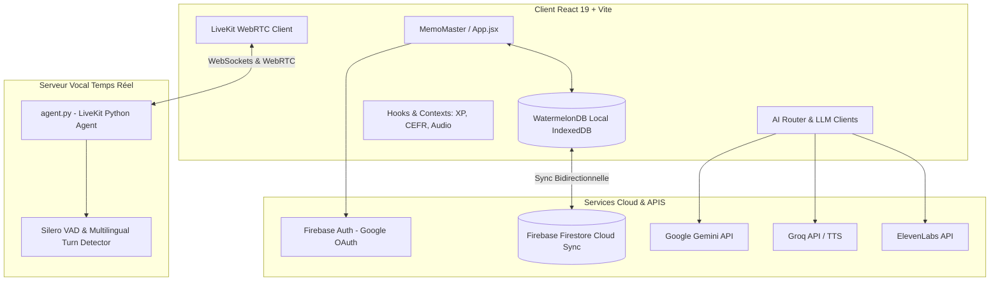

# 📖 Documentation Technique Complète et Exhaustive de MemoMaster (memo-app)

> Ce document constitue la référence intégrale de l'application **MemoMaster** (`memo-app`). Il détaille chaque couche d'architecture, chaque module UI, chaque hook personnalisé, chaque utilitaire du dossier `src/lib/`, le schéma de base de données, la logique vocale/IA ainsi que le serveur backend Python LiveKit.

---

## 📌 1. Vue d'Ensemble & Mission

**MemoMaster** est une Progressive Web App (PWA) *offline-first* conçue pour l'apprentissage accéléré, la mémorisation durable par répétition espacée (SRS), l'immersion linguistique en anglais et la préparation aux certifications technologiques.

### Valeur Ajoutée & Piliers :
1. **Répétition Espacée Intelligente (FSRS / SM-2)** : Planification scientifique des révisions de fiches avec suivi des états de maîtrise (*Mastery Stages*).
2. **Pratique Vocale & IA Temps Réel** : Agents conversationnels vocaux via **LiveKit**, synthèse vocale **ElevenLabs / Groq TTS**, reconnaissance vocale (Web Speech API / VAD).
3. **Simulations Métier & Recrutement** : Recruteur fictif (*Phantom Recruiter*), entraînement à l'accent avec l'alphabet phonétique international (IPA), shadowing d'actualités (*Coach News Anchor*).
4. **Hub de Certifications IT** : Simulateur d'examens et suivi de progression pour AWS, GCP, Azure, Kubernetes, Linux, etc.
5. **Veille Technologique & Open Source** : Agrégateur et radar de projets open-source et d'articles tech.
6. **Gamification & Habit Building** : Moteur d'XP, suivi CEFR (A1 à C2), défis quotidiens, mode bataille et suivi de routine avec timers.

---

## 🏗️ 2. Architecture globale du Système



---

## 🗄️ 3. Modèle de Données & Persistance Locale / Cloud

### 3.1. WatermelonDB Local (`src/lib/db/schema.js`)
L'application utilise **WatermelonDB** (avec LokiJS en environnement Web) pour garantir un fonctionnement 100% hors-ligne avec des performances quasi-instantanées.

#### Table `expressions` :
| Colonne | Type | Description |
| :--- | :--- | :--- |
| `id` | String | Identifiant unique de la fiche |
| `front` | String | Contenu du recto (question / terme) |
| `back` | String | Contenu du verso (réponse / définition) |
| `example` | String (Optionnel) | Exemple de phrase ou contexte |
| `category` | String (Optionnel) | Catégorie ou tag de classement |
| `type` | String (Optionnel) | Type de carte (expression, concept, code...) |
| `image_url` | String (Optionnel) | URL d'illustration liée |
| `audio_url` | String (Optionnel) | URL de fichier audio généré ou enregistrement |
| `audio_id` | String (Optionnel) | Identifiant unique du fichier audio associé |
| `layers` | JSON Array (Optionnel) | Explications en couches successives |
| `level` | Number (Optionnel) | Niveau actuel de maîtrise |
| `next_review` | String (Optionnel) | Date ISO de la prochaine révision |
| `ease_factor` | Number (Optionnel) | Facteur de facilité FSRS/SM-2 |
| `interval` | Number (Optionnel) | Intervalle actuel en jours |
| `repetitions` | Number (Optionnel) | Nombre de révisions consécutives réussies |
| `review_history` | JSON Array (Optionnel) | Historique complet des révisions passées |
| `paused` | Boolean (Optionnel) | Statut de mise en pause de la fiche |
| `mastery_stage` | String (Optionnel) | Étape de maîtrise (ex: *Learning*, *Reviewing*, *Mastered*) |
| `productive_uses` | JSON Array (Optionnel) | Historique des utilisations actives/orales |
| `last_productive_use_at` | Number (Optionnel) | Timestamp de la dernière utilisation productive |
| `created_at` / `updated_at` | Number | Timestamps de création et mise à jour |

### 3.2. Synchronisation Firebase Firestore (`src/lib/db/sync.js`)
- Les fiches locales sont synchronisées sous le chemin Firestore : `users/{uid}/expressions/{id}`.
- Un écouteur `onSnapshot` assure la synchronisation temps réel inter-appareils.
- Gestion automatique des conflits basée sur `updated_at`.
- Isolement strict par utilisateur grâce aux règles [firestore.rules](file:///c:/Users/LENOVO/memo-app/firestore.rules).

---

## 🧩 4. Inventaire Exhaustif des Composants UI (`src/components/`)

1. **`AccentTraining.jsx`** : Module d'entraînement à la prononciation anglaise. Compare la voix de l'utilisateur avec la norme IPA (International Phonetic Alphabet) et fournit un score de précision.
2. **`AudioPlayButton.jsx`** : Bouton réutilisable de lecture audio gérant les états de chargement, de lecture et les erreurs TTS.
3. **`BattleMode.jsx`** : Quiz interactif gamifié sous forme de duel contre la montre pour tester ses connaissances de manière dynamique.
4. **`BetaChat.jsx`** : Interface de chat intégrée pour remonter du feedback ou échanger avec l'assistant de l'application.
5. **`BulkRestructureBar.jsx`** : Barre d'outils permettant d'effectuer des opérations groupées sur les fiches (restructuration, recatégorisation, réinitialisation de la répétition espacée).
6. **`CEFRTracker.jsx`** : Composant de visualisation du niveau de maîtrise de la langue selon le Cadre Européen Commun de Référence pour les Langues (CEFR A1 à C2).
7. **`CertificationsDashboard.jsx`** : Tableau de bord de préparation aux certifications IT (AWS, Azure, GCP, Kubernetes, etc.) avec simulateurs d'examens et statistiques par domaine.
8. **`CoachNewsAnchor.jsx`** : Exercice d'entraînement à l'écoute et à la présentation type présentateur d'actualités télévisées.
9. **`CoachSpeedListening.jsx`** : Exercice d'écoute à vitesse variable pour améliorer la compréhension auditive rapide.
10. **`DailyRoutineTracker.jsx`** : Suivi des objectifs et routines d'apprentissage de la journée avec indicateurs visuels d'accomplissement.
11. **`ErrorBoundary.jsx`** : Composant React d'interception des erreurs d'exécution UI pour éviter le crash complet de l'application.
12. **`GodTierContent.jsx`** : Module d'affichage et de filtrage de contenus à très forte valeur ajoutée.
13. **`GodTierStats.jsx`** : Graphiques avancés et métriques globales de performance d'apprentissage.
14. **`HoloCard.jsx`** : Carte UI à effet holographique / 3D pour la mise en valeur des accomplissements et fiches maîtresses.
15. **`KnowledgeGraph.jsx`** : Cartographie sous forme de graphe de connaissances interconnectant les concepts et catégories de fiches.
16. **`LiveKitAgentBar.jsx`** : Barre de contrôle simplifiée pour lancer et contrôler une session avec l'agent vocal LiveKit.
17. **`LiveKitVoiceAssistant.jsx`** : Interface d'agent vocal interactif complète utilisant WebRTC via LiveKit pour une conversation orale fluide et sans latence.
18. **`LiveNewsModule.jsx`** : Flux d'actualités anglophones en direct servant de support pour la lecture et le vocabulaire contextuel.
19. **`MobileAddSheet.jsx`** : Fiche tiroir (bottom sheet) optimisée pour les smartphones permettant d'ajouter rapidement une nouvelle carte.
20. **`MobileHomeV2.jsx`** : Page d'accueil alternative et épurée spécialement conçue pour l'ergonomie mobile tactile.
21. **`MobileSpeedDial.jsx`** : Bouton d'action rapide flottant pour les appareils mobiles.
22. **`OfflineBanner.jsx`** : Bannière d'avertissement non intrusive s'affichant en cas de perte de connexion réseau.
23. **`OpenSourceRadar.jsx`** : Radar de projets et dépôts open source tendances à explorer pour enrichir son vocabulaire dev.
24. **`PhantomRecruiter.jsx`** : Simulateur d'entretiens d'embauche techniques oraux où un recruteur virtuel pose des questions orientées carrière et évalue les réponses.
25. **`ProductionChallenge.jsx`** : Défis d'expression active obligeant l'utilisateur à réutiliser un mot cible dans une phrase originale.
26. **`RichText.jsx`** : Composant de rendu Markdown et syntaxe enrichie avec support des blocs de code et diagrammes Mermaid.
27. **`RoutineTimerOverlay.jsx`** : Overlay de chronomètre pour cadrer les sessions de révision intensives (Pomodoro / Routine).
28. **`SoundwavePlayer.jsx`** : Visualiseur de forme d'onde audio pour les enregistrements vocaux.
29. **`SpeakItChallenge.jsx`** : Challenge de reconnaissance vocale obligeant à prononcer la phrase affichée sans erreur.
30. **`StatsInsights.jsx`** : Analyse des données de révision, prédictions d'oubli et recommandations d'étude.
31. **`TechIntelView.jsx`** : Vue d'intelligence technologique regroupant les actualités, documentations et fiches techniques.
32. **`TechOracle.jsx`** : Module d'interrogation IA spécialisé sur la résolution de problèmes techniques et d'architecture software.
33. **`UpdatePrompt.jsx`** : Prompt de mise à jour PWA proposant le rechargement lorsque le Service Worker détecte une nouvelle version.

---

## 🛠️ 5. Inventaire des Modules de Services & Utilitaires (`src/lib/`)

- **`aiRouter.js`** : Routeur intelligent d'appels LLM (bascule automatique entre Gemini, Groq ou HuggingFace selon la disponibilité et la latence).
- **`fsrs.js`** : Implémentation des algorithmes de répétition espacée (Free Spaced Repetition Scheduler et SM-2).
- **`certCatalog.js`** : Catalogue de questions, domaines et banques de données pour le tableau de bord des certifications IT.
- **`livekitConfig.js`** : Configuration des tokens, des salles WebRTC et des options d'agent LiveKit.
- **`iosVoiceHardening.js`** : Correctifs et ajustements pour contourner les limitations strictes d'iOS/Safari sur l'audio WebAPI et la synthèse vocale.
- **`groqTTS.js`** & **`HuggingFaceVoice.jsx`** : Intégrations de moteurs TTS légers et rapides.
- **`geminiClient.js`** : Client dédié aux appels de l'API Google Gemini (génération automatique de fiches, explications, traductions).
- **`agentSessionMemory.js`** & **`agentClientTools.js`** : Gestion de la mémoire contextuelle et des outils appelables par l'agent vocal.
- **`masteryStages.js`** : Définition des règles de passage d'une fiche d'un état de découverte à un état de maîtrise ancrée.
- **`htmlSanitizer.js`** & **`jsonRepair.js`** : Utilitaires de sécurité et d'assainissement pour éviter les failles XSS et réparer les réponses JSON altérées des LLMs.
- **`XPSystem.js`** : Règles d'attribution des points XP et calcul du niveau du joueur.
- **`secretsScrubber.js`** & **`csp.js`** : Protection contre les fuites de clés d'API et politique de sécurité du contenu.
- **`articleExtractor.js`** & **`offlineArticles.js`** : Extraction et mise en cache d'articles web pour lecture hors-ligne.
- **`retroEngineeringRestructurer.js`** : Module de refactorisation automatique et de réorganisation intelligente du contenu des cartes.

---

## ⚓ 6. Hooks Personnalisés (`src/hooks/`)

- **`useXP.js`** : Gestion de l'état des points XP, des niveaux, des streaks et de l'animation de gain d'XP.
- **`useCEFR.js`** : Calcul dynamique du niveau CEFR basé sur le volume et le niveau des expressions maîtrisées.
- **`useProductiveUse.js`** : Suivi de l'utilisation active/orale des fiches dans les exercices.
- **`useAudioFeedback.js`** : Gestion des effets sonores d'interaction UI (succès, erreur, validation).
- **`useHighlight.js`** : Surbrillance syntaxique et mise en valeur des mots clés.
- **`useMermaid.js`** : Rendu dynamique des diagrammes Mermaid dans les fiches et descriptions.
- **`useConfetti.js`** : Animation de célébration lors des réussites marquantes.

---

## 🐍 7. Serveur Backend Vocal Python (`agent.py`)

Le fichier [agent.py](file:///c:/Users/LENOVO/memo-app/agent.py) est un agent autonome écrit avec le SDK **LiveKit Agents** en Python.

### Rôle & Fonctionnement :
1. **Connexion au Salon LiveKit** : Écoute les connexions des utilisateurs web.
2. **Extraction des Métadonnées** (`extract_instructions`) : Récupère les instructions personnalisées (ex: rôle du `PhantomRecruiter`, règles du coach de prononciation).
3. **Détection Vocale et Gestion des Tours de Parole** :
   - Utilise **Silero VAD** (*Voice Activity Detection*) pour détecter quand l'utilisateur parle.
   - Utilise le modèle `MultilingualModel` pour décider quand interrompre ou céder la parole de façon naturelle.
4. **Alimentation LLM / TTS** : Transforme le flux audio de l'utilisateur en texte, le traite via un LLM et retransmet la réponse vocale en streaming temps réel.

---

## 💻 8. Commandes & Scripts Utiles

```bash
# Lancement de l'application React en développement
npm run dev

# Construction du bundle de production
npm run build

# Analyse ESLint de la qualité du code
npm run lint

# Lancement de l'agent Python LiveKit (nécessite l'environnement virtuel venv)
python agent.py dev
```

---

## ✅ Summary

La documentation de **MemoMaster** couvre à présent l'intégralité de l'application : de la couche d'accès aux données (WatermelonDB/Firestore) aux hooks React, en passant par les 33 composants UI, la quarantaine de services utilitaires et le backend vocal Python.
